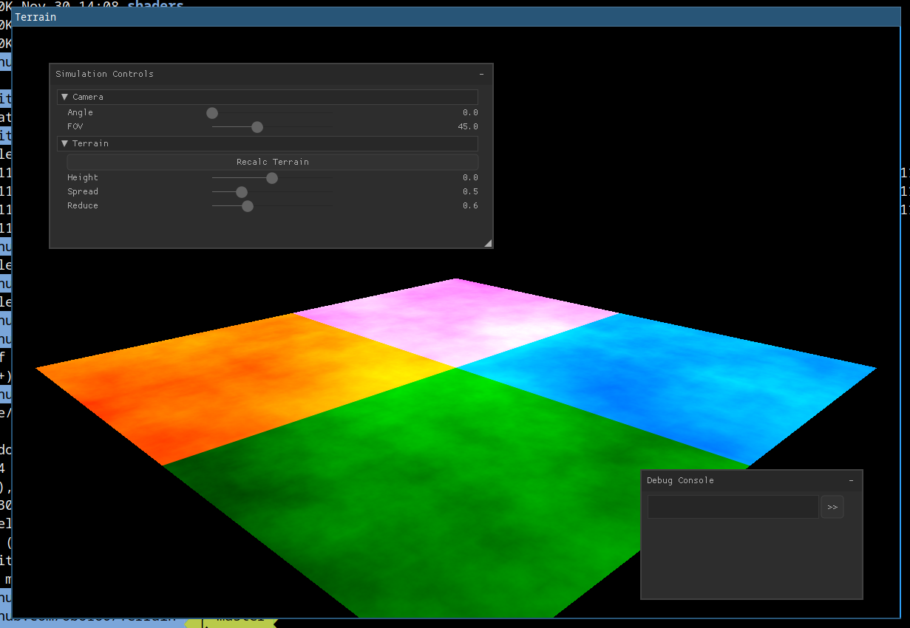

# Independent Project 2019/20 - "Generating and manipulating procedural terrain"
Terrain generation coupled with hydraulic erosion on GPU. Comparison with same implementation on CPU.

## Upcoming milestones

### Erosion

- [ ] Refine existing code/method
- [x] Hydraulic Erosion implementation on GPU (compute shader)
- [ ] Implement suggested improvements from referenced material
- [ ] Research into Thermal Erosion

### Rendering

- [ ] Rendering with surface normals and textures
- [x] Rendering water

### UI

- [ ] Simulation statistics visualisation
- [x] NK label segfault workaround -- Update: used imgui
- [ ] Free floating camera

## Project as of 2019/12/23

- [x] Reference Hydraulic Erosion implemention on CPU

## Project as of 2019/12/03

- [x] Midpoint Displacement
- [x] Rendering as mesh in OpenGL

## Topics of Interest
* Different noise generation techniques (diamond-square etc)
* Hydraulic Erosion
    - Formation of natural phenomena
* Thermal Erosion
* Rendering techniques (vertices, raymarching etc)
* Lighting
* Texturing
* Tiling terrain (infinite scroll)
* Level of Detail
* Mouse picking & terrain manipulation

## Technology Used
* Golang
* OpenGL 4.5
    - Compute Shaders
* GLFW

## References
* Algorithms for Generating Fractal Landscapes - https://pdfs.semanticscholar.org/54f4/3f55700cf94ffa93ef8528fdce80abf2b006.pdf
* Fast Hydraulic and Thermal Erosion on the GPU - https://citeseerx.ist.psu.edu/viewdoc/download?doi=10.1.1.309.3824&rep=rep1&type=pdf
* Interactive physically based Fluid and Erosion Simulation - https://pdfs.semanticscholar.org/f5e8/a436fb57e890b458f88d85588f53e0712fbb.pdf
* Implementation of a method for hydraulic erosion - https://www.firespark.de/resources/downloads/implementation%20of%20a%20methode%20for%20hydraulic%20erosion.pdf
